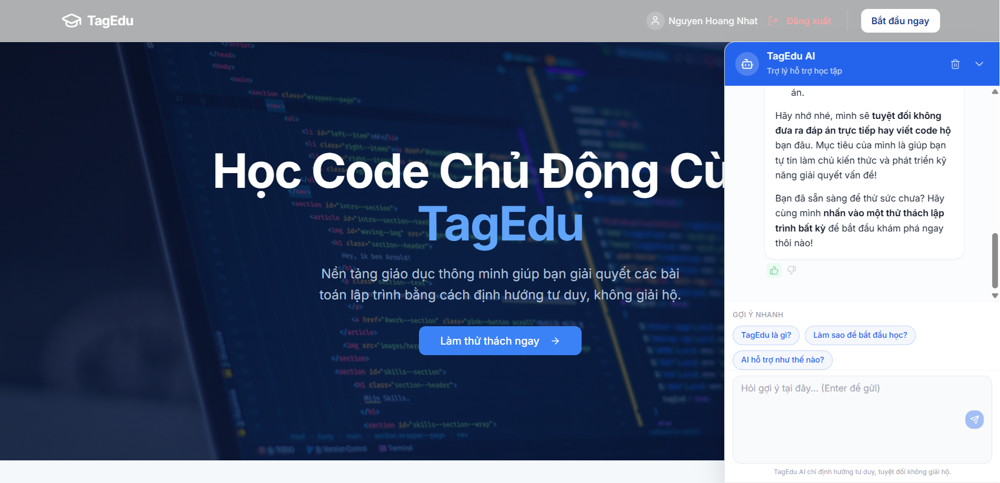
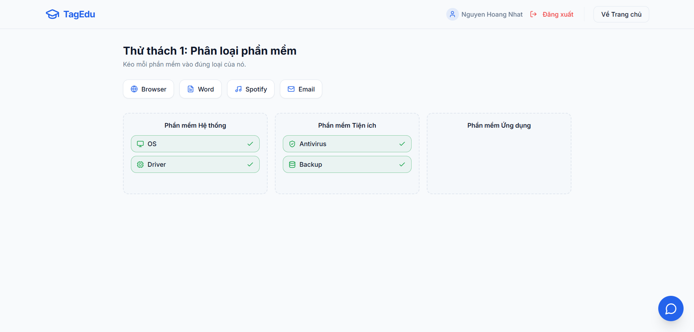
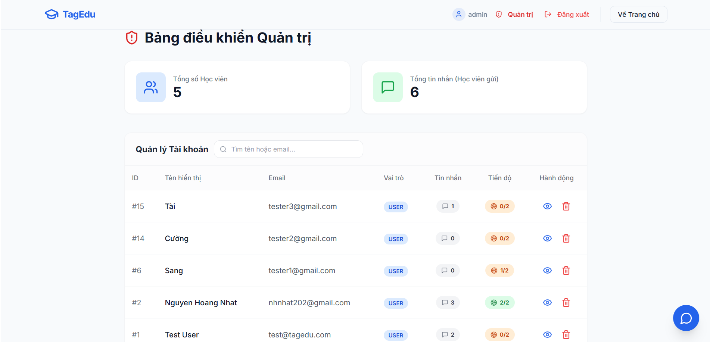
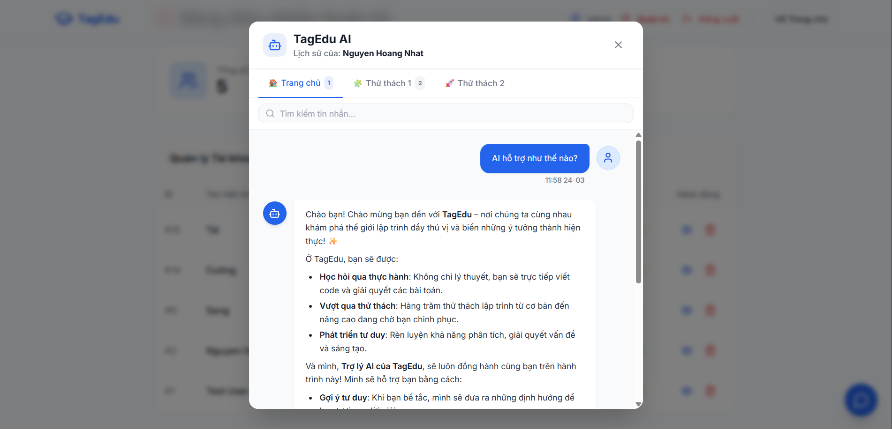

# TagEdu - Học Code Chủ Động

Nền tảng giáo dục lập trình thông minh, giúp học viên giải quyết bài toán lập trình bằng cách **định hướng tư duy** - không giải hộ.

**Live demo:** [tag-edu-website.vercel.app](https://tag-edu-website.vercel.app)

---

## Ảnh demo









---

## Tính năng nổi bật

### Phía học viên
- **Thử thách lập trình tương tác** - Drag & drop phân loại phần mềm, suy luận chức năng hệ thống tàu vũ trụ,...
- **Trợ lý AI TagEdu** - Chatbot AI sư phạm hỗ trợ theo từng trang (Trang chủ / Thử thách 1 / Thử thách 2), gợi ý tư duy thay vì đưa đáp án
- **Gợi ý nhanh (Quick replies)** - Câu hỏi mẫu thay đổi theo context đang học
- **Feedback tin nhắn** - Like / Dislike từng phản hồi của AI, lưu vào database
- **Lịch sử chat** - Tự động lưu và khôi phục khi quay lại

### Phía quản trị (Admin)
- **Bảng điều khiển** - Thống kê tổng số học viên và tin nhắn
- **Quản lý tài khoản** - Xem, tìm kiếm (theo tên/email), xóa tài khoản
- **Giám sát lịch sử chat AI** - Xem toàn bộ cuộc trò chuyện của từng học viên, phân tab theo Trang chủ / Thử thách 1 / Thử thách 2, tìm kiếm nội dung tin nhắn, xem trạng thái feedback

---

## Tech Stack

| Phần | Công nghệ |
|---|---|
| Frontend | React + TypeScript + Vite |
| Styling | Tailwind CSS + shadcn/ui |
| Backend | Node.js + Express |
| Database | MySQL (Aiven Cloud) |
| AI | Google Gemini 2.5 Flash (streaming) |
| Deploy | Vercel (Frontend) |

---

## Cấu trúc project

```
TagEdu-Website/
├── tagedu-ai-backend/
│   ├── config/db.js
│   ├── controllers/
│   │   ├── adminController.js
│   │   ├── authController.js
│   │   ├── chatController.js
│   │   └── userController.js
│   ├── middlewares/
│   │   ├── adminMiddleware.js
│   │   └── authMiddleware.js
│   ├── routes/
│   │   ├── adminRoutes.js
│   │   ├── authRoutes.js
│   │   ├── chatRoutes.js
│   │   ├── progressRoutes.js
│   │   └── userRoutes.js
│   └── server.js
│
└── tagedu-ai-website/
    └── src/
        ├── components/
        │   ├── ChatbotWidget.tsx
        │   ├── AdminDashboard.tsx
        │   ├── Challenge7.tsx
        │   ├── Challenge8.tsx
        │   └── ...
        └── hooks/
            └── useChatbot.ts
```

---

## Hướng dẫn chạy local

### 1. Clone repo
```bash
git clone https://github.com/HoangNhat2004/TagEdu-Website.git
cd TagEdu-Website
```

### 2. Chạy Backend
```bash
cd tagedu-ai-backend
npm install
```

Tạo file `.env`:
```env
PORT=5000
DB_HOST=your_mysql_host
DB_PORT=your_mysql_port
DB_USER=your_user
DB_PASSWORD=your_password
DB_NAME=your_database
JWT_SECRET=your_jwt_secret
GEMINI_API_KEY=your_gemini_api_key
```

```bash
node server.js
```

### 3. Chạy Frontend
```bash
cd tagedu-ai-website
npm install
```

Tạo file `.env`:
```env
VITE_API_URL=http://localhost:5000/api
```

```bash
npm run dev
```

### 4. Thiết lập Database

Tạo database và chạy lần lượt các lệnh SQL sau:

```sql
CREATE DATABASE tagedu_db CHARACTER SET utf8mb4 COLLATE utf8mb4_0900_ai_ci;
USE tagedu_db;

CREATE TABLE users (
  id INT NOT NULL AUTO_INCREMENT,
  full_name VARCHAR(100) NOT NULL,
  email VARCHAR(100) NOT NULL,
  password_hash VARCHAR(255) NOT NULL,
  created_at TIMESTAMP DEFAULT CURRENT_TIMESTAMP,
  reset_otp VARCHAR(6) DEFAULT NULL,
  reset_otp_expiry DATETIME DEFAULT NULL,
  profile_bio TEXT,
  role ENUM('user', 'admin') DEFAULT 'user',
  PRIMARY KEY (id),
  UNIQUE KEY email (email)
);

CREATE TABLE chat_messages (
  id INT NOT NULL AUTO_INCREMENT,
  user_id INT NOT NULL,
  challenge_id VARCHAR(50) DEFAULT NULL,
  session_id VARCHAR(100) DEFAULT 'default_session',
  sender_role ENUM('user', 'ai') NOT NULL,
  content TEXT NOT NULL,
  created_at TIMESTAMP DEFAULT CURRENT_TIMESTAMP,
  feedback ENUM('up', 'down') DEFAULT NULL,
  PRIMARY KEY (id),
  KEY user_id (user_id),
  CONSTRAINT chat_messages_ibfk_1 FOREIGN KEY (user_id) REFERENCES users (id) ON DELETE CASCADE
);

CREATE TABLE user_progress (
  id INT NOT NULL AUTO_INCREMENT,
  user_id INT NOT NULL,
  challenge_id VARCHAR(50) NOT NULL,
  is_completed TINYINT(1) DEFAULT 0,
  completed_at TIMESTAMP DEFAULT NULL,
  PRIMARY KEY (id),
  KEY user_id (user_id),
  CONSTRAINT user_progress_ibfk_1 FOREIGN KEY (user_id) REFERENCES users (id) ON DELETE CASCADE
);
```

Lưu ý: Tạo bảng theo đúng thứ tự trên vì `chat_messages` và `user_progress` phụ thuộc vào bảng `users`.

---

## Nguyên tắc AI sư phạm

1. **Không đưa đáp án trực tiếp** - Tuyệt đối không giải hộ dưới mọi hình thức
2. **Gợi ý tư duy** - Đặt câu hỏi mở, gợi mở hướng suy nghĩ
3. **Giải thích logic** - Giúp học viên hiểu rõ khái niệm và lỗi sai
4. **Đưa ví dụ tương tự** - Cung cấp ví dụ để học viên tự áp dụng

---

## Tác giả

**Nguyen Hoang Nhat**  
Email: nhnhat202@gmail.com  
GitHub: [github.com/HoangNhat2004](https://github.com/HoangNhat2004)
